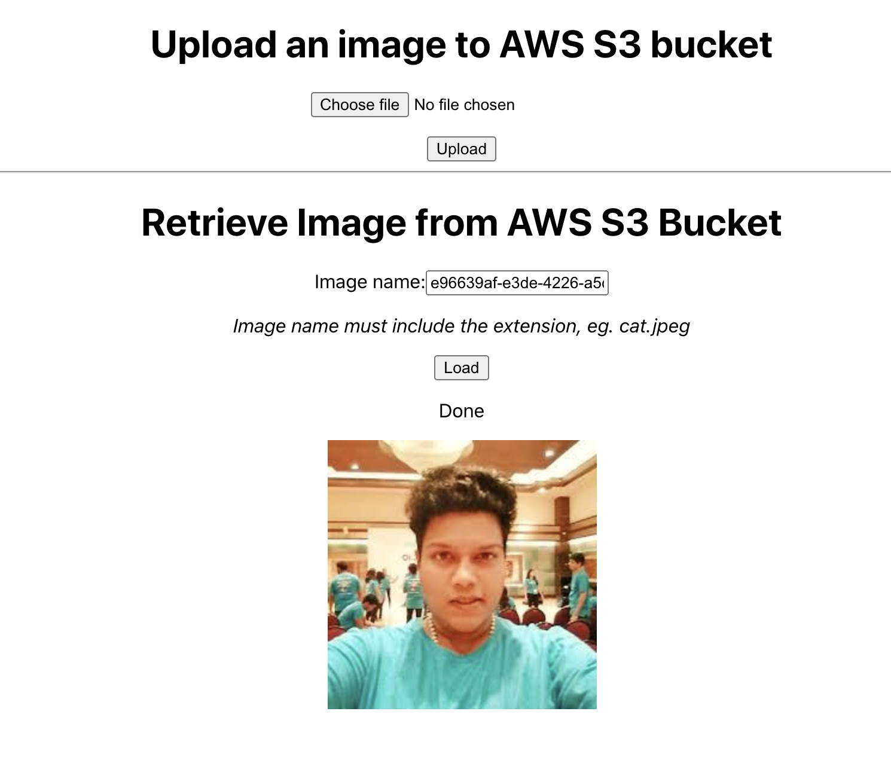

# scalable-image-upload
Scalable image/file upload using Nodejs, React Js and utilising AWS S3 signed url.

There are many resources/blog online that offer suggestions on how to handle file upload (Bad Approach eg: multer npm module - saving files directly on your server isn't a scalable solution! or dealing image with temp storage in server and then upload to AWS s3 is a 2 way approach which uses some amount of resources like CPU and ram to deal with image with single user file upload) but few resource show a solution that can truly scale. AWS S3 to implement file upload that can scale to millions of users (Direct upload image from react to s3 and no server handling) and handling uploads with security concerns.

